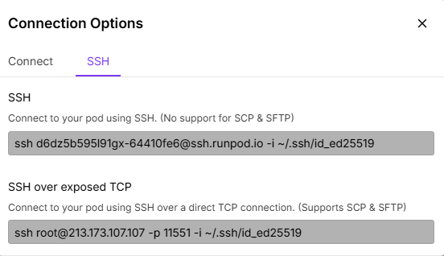

# 📦 Developing FastVideo on RunPod

You can easily use the FastVideo Pod Template on [RunPod](https://www.runpod.io) for development or experimentation.

## Creating a new pod

- Make sure you are using the correct RunPod account.


- Use "Additional Filters" to select CUDA 12.8.


- Click "Deploy" and Pick a single A40 or RTX 4090 GPU.


- Select the "FastVideo" or "fastvideo-dev" Pod Template.


- Set the Pod name to "<name>-<FastVideo>-<date>".

- Finally, once the pod is deployed (will take a few minutes as the image is being pulled), you can SSH into it using "SSH exposed over TCP". You'll need to use the matching private ssh key you provided.


## Working with the pod

After SSH'ing into your pod, you'll find the correct `uv` environment already activated and you should be in /FastVideo/ directory. Make sure to use /FastVideo/ for all your work.

To pull in the latest changes from the GitHub repo:

```bash
cd /FastVideo
git pull
```

Run your development workflows as usual:

```bash
# Run linters
pre-commit run --all-files

# Run tests
pytest tests/
```

Make sure to push your changes back to the GitHub repo as nothing will be saved to the pod when it is terminated.

After you are done with your work, you can terminate the pod by clicking the "Terminate" and "Delete" buttons. Remember if the pod is not completely deleted, Runpod will keep charging you for it.

## Extra Information:
If you need to customize the pod template this section has some useful information. For the most part you can leave the defaults of the FastVideo Pod Template.

When creating your pod template, use this image:

```
ghcr.io/hao-ai-lab/fastvideo/fastvideo-dev:py3.12-latest
```

Paste Container Start Command to support SSH ([RunPod Docs](https://docs.runpod.io/pods/configuration/use-ssh)):

```bash
bash -c "apt update;DEBIAN_FRONTEND=noninteractive apt-get install openssh-server -y;mkdir -p ~/.ssh;cd $_;chmod 700 ~/.ssh;echo \"$PUBLIC_KEY\" >> authorized_keys;chmod 700 authorized_keys;service ssh start;sleep infinity"
```


