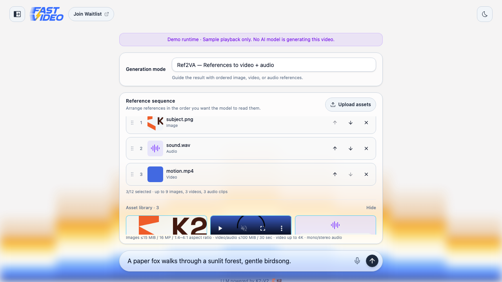

# Dreamverse Development

Dreamverse lives under `apps/dreamverse/` as a product app inside the
FastVideo monorepo. Backend code uses the local FastVideo workspace package;
frontend tooling remains standalone under `apps/dreamverse/web/`.

## Backend tests

Run backend tests excluding GPU-marked cases from the FastVideo repository
root:

```bash
uv run --locked --package dreamverse --extra test pytest apps/dreamverse/dreamverse/tests/ -m 'not gpu' -q
```

Collection can still touch FastVideo streaming imports that probe for an active
GPU driver, so the corresponding CI job runs on a GPU even with GPU-marked tests
excluded.

## Backend launch

Launch the migrated backend through the installed console commands:

```bash
dreamverse-server --port 8009
dreamverse-mock-server --port 8009
```

If `dreamverse-server` is missing, install FastVideo with the `dreamverse`
extra from the checkout:

```bash
UV_TORCH_BACKEND=cu126 uv pip install -e ".[dreamverse]"  # use cu130 on CUDA 13
```

## Frontend build and tests

Run frontend commands from the standalone web app:

```bash
cd apps/dreamverse/web
npm ci
npm run build
npm test
```

Playwright is intentionally run against a live backend as part of the local GPU
manual verification flow, not in the Phase 3 migration gate.

## Local GPU verification

Choose an available physical GPU for full-stack smoke tests. For example,
`CUDA_VISIBLE_DEVICES=4` makes physical GPU 4 appear as logical GPU 0 inside
the process.

For a managed backend-and-frontend redeploy with readiness checks and logs,
use the repo-local skill helper:

```bash
./.agents/skills/dreamverse-deploy/scripts/dreamverse-deploy.sh 4 8009 5299
```

The helper's legacy frontend default is `5274`, so the example passes the web
app's current port, `5299`, explicitly. It writes logs under
`/tmp/opencode/dreamverse-deploy`. The equivalent manual backend launch is:

```bash
CUDA_VISIBLE_DEVICES=4 dreamverse-server --host 0.0.0.0 --port 8009
```

In another shell, verify the service:

```bash
curl -s http://localhost:8009/healthz
```

The full Playwright suite expects `/healthz`, `/readyz`, `/status`,
`/prompt-system-config`, and `/curated-presets` from the Dreamverse backend.

## H3 generation modes

Dreamverse exposes the running model's supported modes through
`GET /generation-capabilities`. The default LTX profiles and FastH3 Preview
support T2VA. Start the full checkpoint profile to enable all three modes:

```bash
DREAMVERSE_MODEL_ID=full-h3 DREAMVERSE_SP_SIZE=4 FASTVIDEO_GPU_COUNT=4 \
  dreamverse-server --host 127.0.0.1 --port 8009
```

This profile uses the full `MiniMaxAI/MiniMax-H3` weights, 50 denoising steps,
and four GPUs on one node by default. It does not apply the T2VA-only Preview
LoRA. On Slurm, run inside your allocation and preserve the scheduler's
`CUDA_VISIBLE_DEVICES`; the local single-GPU deployment helper is not suitable.
See the [Slurm demo launcher](../../apps/dreamverse/scripts/slurm/README.md).

| Mode | Inputs | H3 pipeline |
| --- | --- | --- |
| T2VA | Text prompt; no conditioning assets | Base |
| FL2VA | First-frame image required, last-frame image optional | Base with first/last-frame conditioning |
| Ref2VA | Ordered image/video/audio references, at least one visual reference | Reference transformer |

The Asset List owns uploads and the composer selects their roles. Ref2VA allows
at most nine image, three video, three audio, and twelve total references.
Images accept PNG, JPEG, and WebP up to 15 MiB and 16 megapixels. Videos accept
MP4, MOV, and WebM; audio accepts WAV, MP3, M4A, FLAC, OGG, and WebM. Video/audio
uploads are limited to 100 MiB and 30 seconds, and videos must be 4K or smaller.
Ref2VA images must have aspect ratios between 1:4 and 4:1. Audio, including
video soundtracks, must be mono or stereo.
The runtime validates actual media content with Pillow or FFprobe. FFmpeg and
FFprobe must be installed; PyAV is also required by the H3 reference pipeline.

Uploads use `POST /assets` with a raw file body, a supported `Content-Type`, and
an optional percent-encoded `X-Asset-Name`. The response includes an opaque
`asset_id`, media metadata, and a same-origin preview URL. GET/HEAD and DELETE
are supported at `/assets/{asset_id}`. The runtime library is limited to 100
assets and 2 GiB. Assets remain available until deleted or the runtime exits;
project metadata persists in the browser, but expired uploads must be uploaded
again after a runtime restart. Assets in an active session cannot be deleted.

Both `session_init_v2` and `project_init_v1` accept the same typed fields:

```json
{
  "generation_mode": "fl2va",
  "conditioning_assets": [
    {"asset_id": "<first-image-id>", "role": "first_frame"},
    {"asset_id": "<last-image-id>", "role": "last_frame"}
  ]
}
```

Ref2VA entries use `role: "reference"`; their array order is meaningful. T2VA
uses an empty array. Do not send file paths or binary media inside websocket
JSON. Omitting both fields preserves the legacy protocol, including its
`initial_image` support. Explicit modes cannot also use `initial_image`.
Invalid requests receive `error_code: "invalid_generation_input"` before GPU
generation. The mode and assets are locked within a project.

FL2VA applies the selected first/last frames to the first segment; later
segments continue from the previous final frame. Ref2VA reuses its ordered
references for each segment, producing reference-conditioned clips without
promising temporal continuation. Starting a project in a different H3 pipeline
unloads the previous executor before loading the other transformer. This can
take time; both transformers are never intentionally kept resident together.
Full H3 sessions default to a two-hour limit, configurable with
`DREAMVERSE_SESSION_TIMEOUT_SECONDS`.



### Mode validation and demo

GPU-independent upload, parser, and mock-stream contract tests can run with a
minimal Python environment (FastAPI, Pillow, HTTPX, NumPy, and pytest):

```bash
python -m pytest apps/dreamverse/dreamverse/tests/test_generation_inputs.py \
  apps/dreamverse/dreamverse/tests/test_mock_server.py -q
```

For UI development, start `dreamverse-mock-server --port 8009`, then the normal
frontend. The page explicitly labels this as a mock demo. It validates real
uploads and mode contracts but returns a synthetic test-pattern clip; it does
not test H3 output quality or GPU performance. Run the generation-mode
Playwright spec against that server and use an actual `full-h3` runtime to
validate model output. Real acceptance requires a completed audio/video clip
for each mode, plus a base-to-reference and reference-to-base project switch.

## Production-equivalent GPU prerequisites

For the production-equivalent NVFP4 path, install these dependencies
in the FastVideo `.venv` before GPU smoke tests:

```bash
uv pip install --python .venv/bin/python \
  flashinfer-python flash-attn cerebras-cloud-sdk openai \
  --no-build-isolation
```

| Package | Why |
|---|---|
| `flashinfer-python` | Required for NVFP4 quantization. Without it, model load fails with `ImportError: NVFP4 quantization requires flashinfer`. |
| `flash-attn` | Optional but recommended; without it attention falls back to Torch SDPA (functional but slower). |
| `cerebras-cloud-sdk` | Required by the migrated prompt enhancer for the default `cerebras` provider. |
| `openai` | Required by the prompt enhancer's OpenAI-compatible providers + downstream rewrites. |

### B200 / sm_100a + gcc-15 conda toolchain (flashinfer JIT workaround)

On hosts where the conda toolchain ships gcc-15 (which nvcc rejects with
`#error -- unsupported GNU version! gcc versions later than 14 are not
supported!`), set these env vars before launching anything that triggers
flashinfer's JIT kernel build:

```bash
export CC=/usr/bin/gcc-13
export CXX=/usr/bin/g++-13
export CUDAHOSTCXX=/usr/bin/g++-13
export NVCC_PREPEND_FLAGS="-ccbin /usr/bin/gcc-13 -allow-unsupported-compiler"
```

`dreamverse-server` does not set these; keep them in the launching shell when
starting it directly. The repo-local `dreamverse-deploy` skill exports them for
managed local launches.
