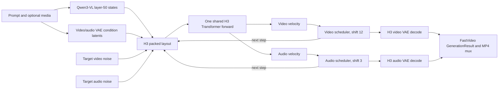

# MiniMax H3: frontier interpretation and FastVideo integration plan

## Executive conclusion

MiniMax H3 should enter FastVideo as a new native model family, not as a Wan variant and not by adapting the LTX-2
denoiser. Its defining contract is one full-self-attention document containing text, visual conditions, target
audio, and target video. One shared Transformer predicts video and audio in the same forward pass, while row-level
modality/timestep conditioning and two schedulers keep the modalities distinct.

The smallest coherent FastVideo design is:

1. Preserve H3's packing, shared audio/video clock, row tags, dual schedulers, dtype islands, and RNG order exactly.
2. Reuse FastVideo's stage composition, model registry, distributed attention, FSDP/offload, result object, and
   existing audio/video mux.
3. Add native H3 Transformer, video VAE, audio VAE, scheduler, conditioner, packing, and joint-denoise stages.
4. Load the Diffusers component layout directly. `t2va/fl2va` selects `transformer/`; `ref2va` selects
   `transformer_ref/`. Never load both partitions into one pipeline.
5. Reuse FastVideo's component loaders and stage runtime. `modular_model_index.json` describes upstream execution;
   it is not a second runtime inside FastVideo.
6. Ship inference first. Training, LoRA, quantization, VSA, 2K regeneration, and full-graph compilation are not v1
   scope.

## Current constraint

The MiniMax H3 checkpoint is not available in this workspace. Therefore real-weight component parity, end-to-end
parity, quality comparison, and performance remain unverified. The architecture below comes from
[Diffusers PR #14355](https://github.com/huggingface/diffusers/pull/14355), which is still a draft implementation.

Without real checkpoint access, parity means:

- exact packing, tensor shape, position, modality-tag, timestep, scheduler, and RNG-order tests;
- reference-vs-FastVideo component tests using the same synthetic or tiny random weights;
- strict-load tests using synthetic Diffusers component folders;
- pipeline tests with tiny components to prove that data and state flow are correct.

After real checkpoint access is available, add real component parity, end-to-end media parity, and Shifu performance
tests.
Until then, any quality, memory, or speed claim remains unverified.

## 1. What MiniMax H3 actually computes

### 1.1 Tasks and checkpoint topology

The Diffusers PR exposes three workflows:

| Workflow | Input | Output | Transformer partition |
|---|---|---|---|
| `t2va` | text | video + stereo audio | `transformer/` |
| `fl2va` | text + first frame, last frame, or both | video + stereo audio | `transformer/` |
| `ref2va` | text + ordered image/video/audio references | video + stereo audio | `transformer_ref/` |

The two Transformer partitions have the same architecture but different weights. They share the Qwen3-VL
conditioner, tokenizer, processor, video VAE, audio VAE, and two scheduler configurations.

The end-to-end data flow is:



Diffusers represents this with Modular Pipeline blocks. That block system is packaging, not a checkpoint contract;
FastVideo only needs to preserve the computation and state boundaries.

### 1.2 Packed-sequence contract

For `t2va/fl2va`, the row order is:

```text
[ text | keyframe condition rows | target audio rows | target video rows ]
```

For `ref2va`, ordered reference blocks are inserted before the targets:

```text
[ text | reference block 1 | reference block 2 | ... | target audio | target video ]
```

Each row carries:

- a three-axis RoPE position `(t, h, w)`;
- a modality tag: video `0`, text `1`, audio `2`;
- an index into the distinct timestep values present in this forward;
- an index set that identifies video, audio, and text rows for scatter/gather.

The Transformer batch dimension only replicates the same structural layout. The draft pipeline accepts a
single prompt; the model class can replicate one layout across a batch, but arbitrary per-sample layouts are not
supported.

### 1.3 Concrete tensor geometry

For an aligned output frame count:

```text
pixel frames:       F     = 17n + 5
video latent frames: F_l  = 5n + 2
audio latent frames: A    = round(F / 24 * 40)
```

Video:

- pixel tensor: `[1, 3, F, H, W]`;
- VAE latent: `[1, 24, F_l, H/16, W/16]`;
- Transformer patch: `(1, 2, 2)`;
- one video row: `24 * 1 * 2 * 2 = 96` values.

Audio:

- 32 kHz waveform;
- VAE hop: 800 samples, or 40 latents/second;
- mono VAE boundary, with stereo represented as two batch items;
- latent: `[2, 32, A]`;
- Transformer rows: `[2A, 32]`, ordered channel-major.

At the default `124 x 768 x 1344`:

- video latent grid: `37 x 48 x 84`;
- target video rows: `37 * 24 * 42 = 37,296`;
- target audio rows: `2 * 207 = 414`;
- text and condition/reference rows are additional.

The main denoiser therefore runs full attention over roughly 38,000 rows before references. This makes sequence
parallelism, attention backend selection, and memory movement part of the base architecture rather than optional
later optimization.

### 1.4 Shared Transformer

The Transformer implementation in [Diffusers PR #14355](https://github.com/huggingface/diffusers/pull/14355)
specifies:

| Item | Value |
|---|---:|
| Main blocks | 50 |
| Text-refiner blocks | 2 |
| Residual width | 5,376 |
| Attention | 56 heads x 128 |
| Attention inner width | 7,168 |
| FFN width | 14,336 |
| Video input width | 96 |
| Audio input width | 32 |
| Qwen context width | 5,120 |
| Video latent channels | 24 |
| Audio latent channels | 32 |

There is no text cross-attention and no explicit audio↔video cross-attention. Before the shared main stack, text
rows alone pass through two text-refiner blocks. Video, audio, and refined Qwen states are then projected into one
5,376-wide residual stream and pass through the same 50 blocks. Within that main stack, modality specialization is
limited to:

- separate video, audio, and context input projections;
- row-level modality tags;
- modality/timestep-conditioned AdaLN;
- separate video and audio output heads.

For every distinct timestep, each block produces six modulation values for each of the three modalities:

```text
shift_msa, scale_msa, gate_msa, shift_mlp, scale_mlp, gate_mlp
```

A row selects its modulation using:

```text
adaln_row = timestep_index * 3 + modality_tag
```

One forward can therefore carry noisy target video rows, target audio rows at a different noise level, nearly clean
visual conditions, clean audio conditions, and text rows together.

### 1.5 Synchronization is geometry, not post-processing

The packing code in the Diffusers PR places video and audio on one 40-units/second rotary clock:

- audio advances one rotary unit per 40 Hz latent;
- a 24 fps pixel frame advances `5/3` rotary units;
- `24 * 5/3 = 40`.

Because the video VAE has nonuniform temporal grouping, latent-video spans follow:

```text
5/3 * (1, 4, 4, 4, 4)
```

The 3-axis RoPE uses 16 frequencies per axis. The first 96 of each 128-dimensional head are rotated; the last 32
pass through. Stereo rows share time and use the two extremes of the visual width axis.

This gives H3 a direct geometric channel for audiovisual alignment. It does not prove perceptual synchronization by
itself, but it is a materially different mechanism from generating audio after video.

Packing is numerically fragile:

- positions are constructed with NumPy/float64;
- spatial coordinates use `linspace(..., endpoint=False)`;
- timestamp rounding follows Python round-half-even;
- some temporal sums deliberately preserve reference-operation order down to the final ULP.

FastVideo must treat the packer as an exact checkpoint interface, not as ordinary preprocessing that can be
rewritten for style.

### 1.6 Conditioner and reference semantics

The conditioner path in the Diffusers PR uses:

- `Qwen3VLForConditionalGeneration`;
- `Qwen2TokenizerFast`;
- `Qwen3VLProcessor`;
- the unnormalized `hidden_states[50]` from a 64-layer model;
- no language-model head output.

Keyframes and visual references have two conditioning paths:

1. semantic Qwen3-VL vision/text rows;
2. dense video-VAE anchor rows.

Audio references place a textual `<Audio n>:` label in the Qwen presentation, while the waveform itself enters as
audio-VAE anchor rows. A video reference can contribute both dense video rows and its soundtrack.

Reference order is load-bearing. It changes prompt labels and advances the shared rotary clock. The request supports
up to 9 images, 3 videos, 3 audio clips, and 12 total references in the Diffusers PR. Standalone audio references must
be paired with a visual reference.

Conditioning details that must be preserved:

- each visual VAE posterior sample uses a fresh fixed seed `42`, independent of the request seed;
- request-generator conditioning noise is drawn before target video and target audio noise;
- visual-condition latents are noised at `t=0.999`, while the condition-row timestep sent to each Transformer
  forward is `max(video_timestep, 0.999)`;
- audio conditions use posterior mode and remain clean at `t=1.0`;
- condition rows are never updated during denoising.

### 1.7 Dual scheduler and no CFG

H3 requires its own scheduler. It is not configuration-compatible with FastVideo's ordinary flow-match Euler path:

1. The model predicts data-ward velocity:

   ```text
   x0 = x_t + sigma * v
   ```

2. Model time is `t = 1 - sigma`, where `t=1` is clean.
3. The requested count includes terminal zero:

   ```text
   sigmas = linspace(1, 0, num_inference_steps)
   ```

4. The exponential shift is:

   ```text
   shifted_sigma = shift * sigma / (1 + (shift - 1) * sigma)
   ```

Video uses shift `12`; audio uses shift `3`. The Euler update is evaluated in FP32, with `eta=0` and no
re-injected noise. Thirty grid points produce 29 Transformer evaluations.

Guidance is described as distilled into the checkpoint in the Diffusers PR. A correct FastVideo v1 must reject
`negative_prompt` and non-neutral guidance rather than silently run a different algorithm.

### 1.8 Video and audio VAEs

The video VAE is asymmetric:

- causal 3D CNN encoder;
- 16x spatial and 4x temporal compression;
- 24 latent channels with per-channel mean/std;
- ImageNet normalization over an underlying `[0,1]` pixel range;
- noncausal 36-layer, width-2,048 ViT decoder with full attention;
- each latent voxel expands to a `4 x 16 x 16` pixel patch;
- FP32 weights, decoded under FP16 CUDA autocast;
- 256-pixel tiling with at least 64 pixels overlap enabled by default.

Changing tiling changes the output, so it is part of the reference recipe, not merely a memory switch.

The audio VAE is waveform-in/waveform-out:

- DAC-lineage convolutional encoder;
- total encoder stride 800;
- 32-channel latent;
- BigVGAN decoder;
- no mel frontend and no separate vocoder;
- mono model with stereo represented as two batch items;
- FP32 throughout.

The PR author reports that BF16 audio decode is roughly 20 dB quieter. This is author-reported and must be
independently checked, but it makes the FP32 rule an explicit acceptance contract.

### 1.9 Weight and upstream review gaps

The Diffusers component state carries several nontrivial contracts:

- Q/K/V and fused SwiGLU ordering must match the published tensors exactly;
- `rope.inv_freq` is analytic state and must be rebuilt after meta-device initialization;
- Transformer input projections, timestep MLP, and output heads stay FP32 while the block stack is BF16;
- video-VAE projection ordering is part of strict loading;
- audio-VAE weight-normalization and filter buffers must be retained.

The PR author reports bitwise reference trajectories and broad packing coverage, but no full-weight reproducible GPU
gate is available in this workspace. Other open risks are mixed-dtype behavior under quantized loading, multi-GPU
video-VAE decode, full-graph compilation, LoRA support, and enforcement of reference-duration limits.

## 2. Frontier interpretation

### 2.1 The central abstraction shift

H3 treats modality and noise level as **row attributes**, not as separate model branches.

Wan makes video the generated state and injects text/image conditions through dedicated interfaces. LTX-2 keeps
video and audio as distinct streams and explicitly exchanges information between them. H3 projects every modality
into one residual space, then lets every live row attend to every other live row in every block.

That is a more aggressive form of early multimodal fusion:

- synchronization can emerge inside the denoiser at every layer;
- a reference is part of a common context rather than an auxiliary adapter;
- the same block weights can reason across text, media conditions, video targets, and audio targets;
- row-level AdaLN supplies specialization without separate modality stacks.

The corresponding cost is equally structural:

- attention cost grows quadratically with the sum of all text, reference, audio, and video rows;
- row ordering, time coordinates, and RNG order become model semantics;
- one modality cannot be scaled, cached, or replaced independently as easily as in a dual-stream design;
- batching heterogeneous layouts is difficult;
- reference-heavy requests can be substantially more expensive than the nominal 38k-row base case.

### 2.2 Comparison with Wan and LTX

| Dimension | MiniMax H3 | Wan 2.2 family | LTX-2 / 2.3 |
|---|---|---|---|
| Generated state | video + native stereo audio | video; S2V uses audio as an input condition | video + audio |
| Denoiser topology | one shared packed sequence and full self-attention | video self-attention with text/image conditioning | asymmetric video/audio streams |
| Cross-modal fusion | implicit in shared self-attention | no generated audio stream | explicit bidirectional A↔V cross-attention |
| Specialization | input/output projections + per-row AdaLN | task checkpoints; A14B high/low-noise experts | separate modality self-attention, FFN, widths, and VAEs |
| Expert meaning | no MoE in the Diffusers PR | A14B: two denoising-time experts, about 14B active of 27B total; TI2V-5B is dense | capacity split by modality, not denoising time |
| Text/media encoder | Qwen3-VL, including visual references | umT5 text; task-specific visual conditioning | Gemma 3-based conditioning |
| Position/time | one 3-axis RoPE and shared 40-unit/s A/V clock | video 3D position system | video 3D, audio 1D, cross-modal temporal positions |
| Scheduling | two shifted schedulers in one forward | A14B selects one high/low-noise expert per step; dense variants use one DiT | modality-aware dual-stream sampling |
| Guidance | distilled, one forward/step | commonly CFG | base uses modality-aware guidance; distilled variants reduce it |
| Audio decoder | 32 kHz waveform VAE, no vocoder | no target soundtrack in core T2V/I2V | mel/audio VAE plus vocoder path |
| Reference semantics | ordered multimodal context and dense anchor rows | task-specific I2V/FLF/VACE/S2V interfaces | multimodal conditioning within a dual-stream architecture |

Three concise distinctions:

1. Wan 2.2 A14B's experts divide the denoising timeline; H3 places all modalities in the same forward.
2. LTX-2 and H3 both generate native audio/video, but LTX preserves modality-specific streams while H3 shares the
   main stack.
3. H3 presents reference/editing as a relationship inside multimodal context rather than requiring every relation
   to become a new fixed conditioning channel.

Token footprint also needs careful wording:

- H3's VAE plus `2x2` Transformer patch covers about `4 x 32 x 32` pixels per video row;
- this is four times the spatial footprint of Wan 2.1's `4 x 16 x 16` effective token;
- it is close to Wan 2.2 TI2V-5B's reported `4 x 32 x 32` compression;
- LTX uses roughly `8 x 32 x 32`, so H3 retains about twice the temporal token density.

This does not establish a speed ranking. Hardware, attention backend, duration, reference count, guidance forwards,
and resolution must be controlled before making an efficiency claim.

### 2.3 What is not known

The official training data mixture, losses, modality weights, optimizer, learning rate, step count, compute budget,
distillation recipe, ablations, and formal evaluation method are not public in the reviewed sources.

The Diffusers PR covers `t2va/fl2va/ref2va` around its 24 fps, 5–15 second, 768-short-edge reference recipe. It does
not implement every capability in the official H3 announcement, including the complete 2K in-context regeneration
flow, T2I/T2A surface, full editing system, or multi-shot product pipeline.

Do not claim:

- official parameter count is 33B;
- H3 is faster, smaller, higher quality, or more memory-efficient than Wan/LTX;
- one general model means one Transformer checkpoint;
- the PR is merged or its API stable;
- its author-reported parity/performance is a FastVideo result.

## 3. Current FastVideo architecture audit

### 3.1 Reusable foundations

FastVideo already has the right outer runtime:

- `ComposedPipelineBase`, `PipelineStage`, `ForwardBatch`, and stage verification;
- model/config/pipeline registries;
- `DistributedAttention` and sequence-parallel shard/pad/trim;
- FSDP inference, CPU offload, and layerwise offload;
- per-parameter dtype selection used by mixed-precision models;
- typed `GenerationResult` with waveform, sample rate, and MP4 audio mux;
- umbrella model references in the form `org/repo/subfolder`, downloaded with a subfolder allow-list.

MagiHuman is the closest implementation precedent inside FastVideo:

- video/audio/text are packed into one sequence;
- one DiT forward returns video and audio predictions;
- two scheduler states update the two modalities;
- video and audio decode separately;
- shared components can be lazy-loaded from pinned upstream repositories.

This proves the stage architecture can express H3. It does not make MagiHuman's DiT, packer, or single-GPU path
reusable as H3 implementations.

LTX-2 contributes a reusable output convention: its audio decode stage writes
`batch.extra["audio"]` and `batch.extra["audio_sample_rate"]`, which `VideoGenerator` already returns and muxes.
The H3 audio decoder should use the same contract.

### 3.2 Hard incompatibilities

| Current assumption | H3 conflict | Required response |
|---|---|---|
| Root `model_index.json` and full-snapshot download | upstream places both Transformer partitions in one Diffusers component tree | select only the workflow's Transformer subfolder and the shared components |
| module kind inferred from directory key | no `audio_scheduler` semantic role; `transformer_ref` is an alternative source partition | add role-aware audio-scheduler loading and normalize the selected Transformer partition to logical `transformer` |
| `SchedulerLoader` reapplies one global `pipeline_config.flow_shift` | H3 must retain video shift 12 and audio shift 3 simultaneously | instantiate both H3 schedulers from their own checkpoint configs without the generic global override; assert both roles and shifts |
| `audio_vae` loader is decoder-oriented | H3 must encode reference audio and decode targets | add a full audio-VAE loader/config path |
| generic denoiser has one latent/scheduler and Wan-like signature | H3 has packed rows, two times, two schedulers, one joint forward | add an H3 joint-denoise stage |
| `transformer_2` means MoE boundary/refiner | H3 partitions are mutually exclusive workflows | never represent `transformer_ref` as `transformer_2` |
| generic decoder maps `image / 2 + 0.5` | H3 uses ImageNet normalization over `[0,1]` | add an H3 video-decode stage |
| current LingBot Qwen3-VL model removes the vision tower | FL2VA/Ref2VA require Qwen vision tokens | add a full H3 conditioner; reuse only exact language-body primitives |
| first Transformer parameter is expected to match one default dtype | H3 starts with intentional FP32 islands in a BF16 model | validate an explicit mixed-dtype contract |
| base request has no `last_image`, `references`, or inference `audio_latents` | H3 cannot express all inputs | preserve all three fields through the typed request path; validate reference contents in Ref2VA stages |

FastVideo's LTX-2 DiT must not be reused:

- it keeps separate video and audio streams;
- it has explicit text and bidirectional audio/video cross-attention;
- its guidance path can run multiple forwards per step;
- its audio path uses a different representation and vocoder.

FastVideo's Wan DiT must not be reused:

- it generates one video stream;
- text/image conditions cross-attend rather than becoming co-equal packed rows;
- it has one output head and a different scheduling contract.

## 4. Proposed FastVideo design

### 4.1 Design rules

1. **One H3 family, two weight workflows.** Share code, not Transformer weights.
2. **Packing stays outside the model.** The Transformer receives explicit rows, positions, tags, timestep indices,
   and output index sets.
3. **One typed family state.** Do not add dozens of H3-only tensors to `ForwardBatch`.
4. **No second pipeline runtime.** Translate the computation into FastVideo stages.
5. **No silent approximation.** Reject unsupported guidance, duration, reference, dtype, or backend combinations.
6. **No public registry activation before real-checkpoint E2E acceptance.**

### 4.2 Diffusers component layout

The Diffusers repository is the loading boundary:

```text
MiniMaxAI/MiniMax-H3/
  transformer/
  transformer_ref/
  vae/
  audio_vae/
  scheduler/
  audio_scheduler/
  text_encoder/
  tokenizer/
  processor/
  video_processor/
```

`t2va/fl2va` resolves `transformer/`; `ref2va` resolves `transformer_ref/`. FastVideo exposes the selected instance
as the logical `modules["transformer"]` and never loads the other partition. Shared components load from their
published subfolders through the existing component loaders.

FastVideo reads each component's config and state directly. Pipeline stages remain native FastVideo stages; the
upstream Modular graph is an architecture reference, not a runtime dependency.

### 4.3 Pipeline classes and stages

Create:

- `MiniMaxH3BasePipeline`: shared loading, state, packing, denoise, and decode wiring;
- `MiniMaxH3Pipeline`: `t2va/fl2va`, loading the FL2VA partition;
- `MiniMaxH3RefPipeline`: `ref2va`, loading only the Ref2VA partition.

Both expose the selected physical partition as `modules["transformer"]`.

Recommended stage graph:

```text
input validation
  -> H3 text/media conditioning
  -> H3 video/audio condition encoding
  -> H3 layout and target-noise preparation
  -> H3 dual-schedule preparation
  -> H3 joint denoise
  -> H3 audio decode
  -> H3 video decode
  -> existing result/mux
```

The FL2VA and Ref2VA pipelines differ only in validation, conditioner/reference encoding, and physical Transformer
source. They share layout primitives, schedule logic, denoiser, and decoders.

### 4.4 State and API

Add family-local dataclasses:

- `MiniMaxH3Reference`: an ordered image, video, or audio input with explicit media metadata;
- `MiniMaxH3Layout`: positions, tags, row indices, and condition-row counts;
- `MiniMaxH3State`: layout plus references and video/audio target and condition latents.

Store one typed object under `batch.extra["minimax_h3"]`. Stage validators assert its type and required fields.
Public outputs keep the existing generic audio/video fields.

Do not rely on an H3-only `SamplingParam` subclass: the current typed request path constructs the base
`SamplingParam` and then expands it directly into `ForwardBatch`. Keep the request surface narrow:

- preserve `last_image`, `references`, and optional `audio_latents` through `InputConfig`, `SamplingParam`, and
  `ForwardBatch`;
- keep the existing `latents` field as the video-latent override;
- enforce H3 duration and canvas constraints in the first H3 stage, and normalize and validate reference contents in
  the Ref2VA stage;
- move only derived tensors and layout state into `batch.extra["minimax_h3"]`.

Media decoding and resampling should happen in an explicit stage, not inside the reference dataclass constructor.
That keeps I/O observable, testable, and separate from immutable request description.

### 4.5 Native model components

Required native components:

- `MiniMaxH3Transformer`;
- `MiniMaxH3VideoVAE`;
- `MiniMaxH3AudioVAE`;
- `MiniMaxH3Scheduler`;
- `MiniMaxH3Qwen3VLConditioner`.

Transformer requirements:

- FastVideo-native projections with checkpoint key/order differences expressed through `param_names_mapping`;
- attention inner width 7,168 mapped back to residual width 5,376;
- partial 96-of-128 RoPE;
- row-indexed AdaLN;
- two output heads;
- explicit FP32 parameter islands;
- `DistributedAttention` from the first functional version.

`DistributedAttention` cannot apply H3's partial RoPE through its current `freqs_cis` path, which rotates either a
full or half head. The H3 attention block must rotate the first 96 Q/K dimensions locally, leave the final 32
unchanged, and then call `DistributedAttention(..., freqs_cis=None)`.

The current LingBot Qwen path is only a partial precedent. H3 needs the vision tower for keyframes and references,
the language body through layer 50, and no LM head execution. Reuse exact native primitives when checkpoint configs
match; otherwise use a narrow conditioner wrapper rather than claiming the text-only LingBot model is sufficient.

### 4.6 Parallelism, offload, and attention

At default size, single-device eager attention is not the target architecture.

For v1:

- support SDPA and FlashAttention only;
- shard the packed sequence with FastVideo sequence parallelism;
- require `56 % sp_size == 0`;
- pass the original semantic length so `DistributedAttention` trims transport padding before the attention kernel;
- derive one canonical global layout, apply the same transport padding and shard boundaries to hidden rows,
  positions, modality tags, and timestep indices, then gather/unpad before applying global output index sets;
- keep the canonical H3 layout semantically padless; transport padding must never become a real row;
- validate SP=1 against SP=2/4/8, including a length not divisible by SP;
- support FSDP inference plus CPU/layerwise offload;
- preserve FP32 islands through loading, sharding, and forward dtype boundaries.

Postpone VSA, FP8/int8, and regional compilation until BF16/FP32 parity is established. Full-graph compilation is
not a v1 gate because the upstream draft itself does not support it.

### 4.7 Proposed file map

```text
fastvideo/configs/models/dits/minimax_h3.py
fastvideo/configs/models/vaes/minimax_h3_video.py
fastvideo/configs/models/vaes/minimax_h3_audio.py
fastvideo/configs/pipelines/minimax_h3.py
fastvideo/models/dits/minimax_h3.py
fastvideo/models/vaes/minimax_h3_video.py
fastvideo/models/vaes/minimax_h3_audio.py
fastvideo/models/encoders/minimax_h3_qwen3_vl.py
fastvideo/models/schedulers/scheduling_minimax_h3.py
fastvideo/pipelines/basic/minimax_h3/
  minimax_h3_pipeline.py
  minimax_h3_ref_pipeline.py
  pipeline_configs.py
  presets.py
  types.py
  packing.py
  packing_ref2va.py
  stages/
tests/local_tests/minimax_h3/
```

Small core edits are expected in:

- component loading for full audio VAE, `audio_scheduler`, and mixed dtype;
- H3-specific API/schema plumbing;
- model and pipeline registries.

## 5. Work stages on this branch

All implementation stays on `feat/kaiqin/minimax-h3`. These are engineering stages on one branch, not separate PRs.

### Stage 1: contracts, native components, and synthetic parity

Implement the Transformer, video VAE, audio VAE, scheduler, FL2VA packer, direct component loading, and the minimal
`last_image`/`references`/`audio_latents` request plumbing.

Without real checkpoint access, acceptance uses:

- no-skip CPU geometry, packing, scheduler, and component-loading tests;
- the same tiny random weights loaded into the Diffusers reference and FastVideo implementations;
- activation/output parity for the tiny Transformer and both VAEs;
- independent reference and FastVideo packers;
- synthetic Diffusers component folders that verify keys, shapes, dtypes, and strict loading.

### Stage 2: T2VA and first/last-frame pipeline

Implement the FL2VA pipeline, Qwen3-VL conditioner, family state, dual denoising loop, decoders, and result/mux path.

Acceptance without real checkpoint access:

- text-only, first-frame, last-frame, and first+last-frame requests all reach the correct path;
- row order, tags, positions, timesteps, and RNG draws match the reference implementation;
- condition rows remain fixed and one Transformer forward runs per schedule interval;
- tiny deterministic video and stereo-audio outputs flow through `GenerationResult` and MP4 muxing.

### Stage 3: Ref2VA

Implement ordered image/video/audio references, media decoding and resampling, Qwen vision presentation, dense VAE
conditions, the Ref2VA packer, and the separate Ref2VA pipeline.

Acceptance without real checkpoint access:

- multiple ordered images, video with soundtrack, image plus audio, and mixed references build the expected layout;
- changing reference order changes prompt presentation and layout deterministically;
- reference count, pairing, duration, and rate errors are rejected;
- the Ref2VA path never loads the FL2VA Transformer partition.

### Stage 4: real-checkpoint parity, Shifu acceptance, and activation

Start this stage only after the model weights and license are available.

- load each Transformer partition and the real shared components directly from their Diffusers subfolders;
- run real component parity and end-to-end audio/video parity;
- run SP, FSDP, and offload acceptance on Shifu;
- measure memory and latency, then inspect generated motion, audio, and synchronization;
- activate the public registry entry only after these checks pass.

Quantization, VSA, compilation, LoRA, training, and 2K regeneration remain follow-up work after the basic model is
correct.

## 6. Validation plan

### 6.1 CPU contracts

All must run without skip:

- `17n+5 -> 5n+2`;
- 24 fps, 5–15 second alignment;
- canvas/aspect validation;
- video/audio patchify and unpatchify;
- channel-major stereo order;
- row order, tags, indices, and float64 positions;
- FL2VA and Ref2VA time advancement;
- video shift 12 and audio shift 3;
- terminal zero and 30 grid points → 29 evaluations;
- conditioning time values and fixed rows;
- RNG draw order;
- explicit rejection of CFG and negative prompt;
- strict component keys, shapes, dtypes, and parameter-name mappings.

### 6.2 Parity without real checkpoint access

Run the Diffusers reference and FastVideo with the same tiny configuration and random weights:

- Transformer input projections, text refiner, selected blocks, final norm, and both heads;
- Qwen tokens, vision layout, and `hidden_states[50]`;
- video VAE encode/decode, normalization, tiling, and frame geometry;
- audio VAE encode/decode, stereo order, sample rate, waveform length, and amplitude;
- scheduler state at first, middle, and final updates.

The reference and FastVideo packers must be independent. Sharing one packer only proves that both paths consume the
same output; it does not prove that the output is correct.

### 6.3 Parity with the real checkpoint

Run the real checkpoint on Shifu:

| Screen | Purpose |
|---|---|
| 960x544, 124 frames, 30 grid points | fastest real-weight parity screen |
| 768x1344, 124 frames, 30 grid points | default-size acceptance |
| SP=1 vs SP=2/4/8 | distributed numerical parity |
| non-divisible sequence length | SP transport-padding correctness |
| FSDP inference | parameter sharding and mixed dtype |
| CPU/layerwise offload | memory-constrained path |
| FL2VA and Ref2VA variants | prove mutually exclusive component download/load |

Record the command and environment, hardware, peak memory, latency, and generated media. Successful startup alone
does not count; the run must finish and produce valid video plus stereo audio.

### 6.4 End-to-end media acceptance

Use the same seed and inputs in upstream and FastVideo. Check:

- latent trajectories at first, middle, and final steps;
- decoded-video numerical/SSIM regression;
- decoded-audio waveform and STFT regression;
- channel order, amplitude, sample rate, and exact length;
- MP4 contains one video and one stereo-audio stream;
- A/V durations agree within the explicit frame/hop tolerance;
- human inspection for motion, soundtrack content, and synchronization.

Thresholds must be set from measured reference variance. Do not invent them in advance or present an estimate as a
result.

## 7. Go/no-go conditions

Do not activate the model publicly until:

- public or authorized checkpoint access and license are confirmed;
- both Transformer partitions strict-load from their published subfolders;
- full audio-VAE encode/decode works;
- mixed FP32/BF16 loading passes;
- FL2VA real-checkpoint E2E passes on Shifu;
- SP parity passes at more than one world size;
- one joint video/audio regression artifact is reviewed.

Block or rescope if:

- the official technical report or accessed checkpoint changes packing or scheduler semantics;
- shared components differ between partitions;
- reference-heavy full attention is not viable on supported hardware;
- the official 2K path requires a second model/stage not present in the reviewed PR.

## Official model and research sources

- [MiniMax H3 announcement](https://www.minimax.io/blog/minimax-h3)
- [MiniMax H3 ModelScope prerelease entry](https://www.modelscope.cn/models/MiniMax/MiniMax-H3)
- [Wan 2.1 technical report](https://arxiv.org/abs/2503.20314)
- [Wan 2.2 official repository](https://github.com/Wan-Video/Wan2.2)
- [LTX-2 paper](https://arxiv.org/abs/2601.03233)
- [LTX-2 official architecture README](https://github.com/Lightricks/LTX-2/blob/main/packages/ltx-core/README.md)
- [LTX-2.3 release notes](https://ltx.io/blog/ltx-2-3-release)

## Implementation source

- [Diffusers PR #14355](https://github.com/huggingface/diffusers/pull/14355)
