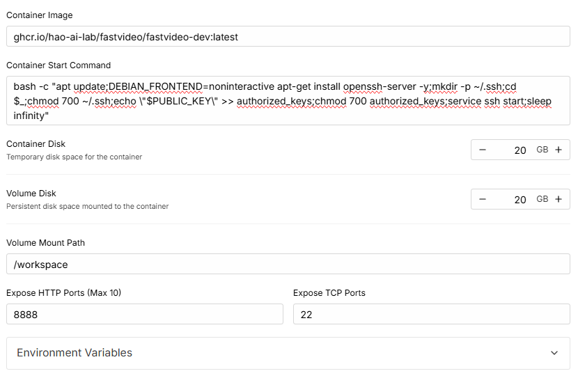

(developer-guide)=

# Contributing to FastVideo

Thank you for your interest in contributing to FastVideo. We want to make the process as smooth for you as possible and this is a guide to help get you started!

Our community is open to everyone and welcomes any contributions no matter how large or small.

# Developer Environment:
Do make sure you have CUDA 12.4 installed and supported. FastVideo currently only support Linux and CUDA GPUs, but we hope to support other platforms in the future.

We recommend using a fresh Python 3.10 Conda environment to develop FastVideo:

Install Miniconda:

```
wget https://repo.anaconda.com/miniconda/Miniconda3-latest-Linux-x86_64.sh
bash Miniconda3-latest-Linux-x86_64.sh
source ~/.bashrc
```

Create and activate a Conda environment for FastVideo:

```
conda create -n fastvideo python=3.10 -y
conda activate fastvideo
```

Clone the FastVideo repository and go to the FastVideo directory:

```
git clone https://github.com/hao-ai-lab/FastVideo.git && cd FastVideo

```

Now you can install FastVideo and setup git hooks for running linting. By using `pre-commit`, the linters will run and have to pass before you'll be able to make a commit.

```bash
pip install -e .[dev]

# Can also install flash-attn (optional)
pip install flash-attn==2.7.0.post2 --no-build-isolation 

# Linting, formatting and static type checking
pre-commit install --hook-type pre-commit --hook-type commit-msg

# You can manually run pre-commit with
pre-commit run --all-files

# Unit tests
pytest tests/
```

---
## 🐳 Using the FastVideo Docker Image

If you prefer a containerized development environment or want to avoid managing dependencies manually, you can use our prebuilt Docker image:

**Image:** [`ghcr.io/hao-ai-lab/fastvideo/fastvideo-dev:latest`](https://ghcr.io/hao-ai-lab/fastvideo/fastvideo-dev)

### 1. Run the container

```bash
docker run --gpus all -it ghcr.io/hao-ai-lab/fastvideo/fastvideo-dev:latest
```

This will:

- Start the container with GPU access  
- Drop you into a shell with the `fastvideo-dev` Conda environment preconfigured

### 2. Inside the container

```bash
# Conda environment should already be active
# FastVideo package installed in editable mode

# Pull the latest changes from remote
cd /FastVideo
git pull

# Run linters and tests
pre-commit run --all-files
pytest tests/
```

---

## 📦 Developing FastVideo on RunPod

You can easily use the FastVideo Docker image as a custom container on [RunPod](https://www.runpod.io) for development or experimentation.

### 1. Create a new Pod

1. Go to [runpod.io](https://www.runpod.io)
2. Choose a GPU that supports CUDA 12.4


3. When creating your pod template, use this image:

```
ghcr.io/hao-ai-lab/fastvideo/fastvideo-dev:latest
```

4. Paste Container Start Command to support SSH ([RunPod Docs](https://docs.runpod.io/pods/configuration/use-ssh)):

```bash
bash -c "apt update;DEBIAN_FRONTEND=noninteractive apt-get install openssh-server -y;mkdir -p ~/.ssh;cd $_;chmod 700 ~/.ssh;echo \"$PUBLIC_KEY\" >> authorized_keys;chmod 700 authorized_keys;service ssh start;sleep infinity"
```



5. Deploy the Pod

### 2. Once the Pod is running

After SSH'ing into your pod, you'll find the `fastvideo-dev` Conda environment already activated.

To pull in the latest changes from the GitHub repo:

```bash
cd /FastVideo
git pull
```

`If you have a persistent volume and want to keep your code changes, you can move /FastVideo to /workspace/FastVideo, or simply clone the repository there.`

Run your development workflows as usual:

```bash
# Run linters
pre-commit run --all-files

# Run tests
pytest tests/
```
